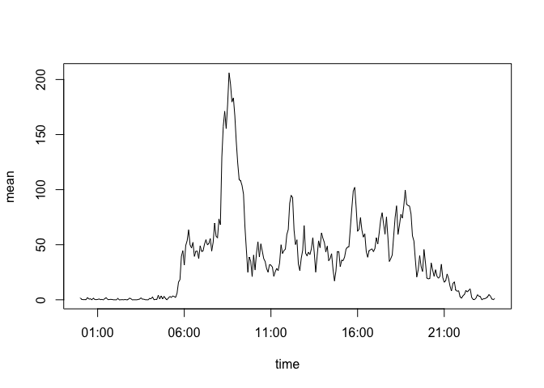
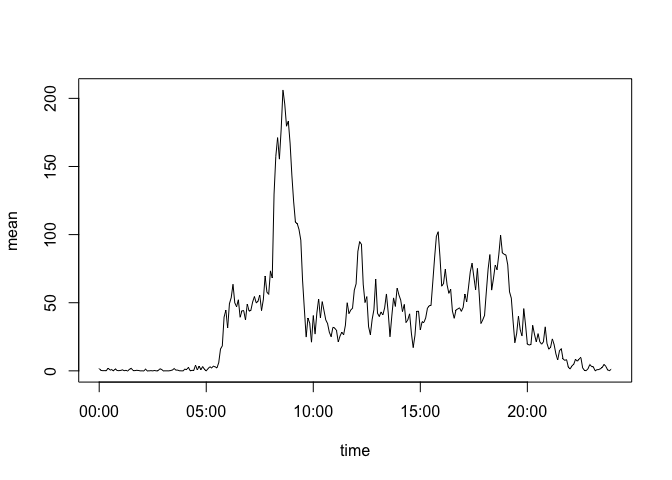
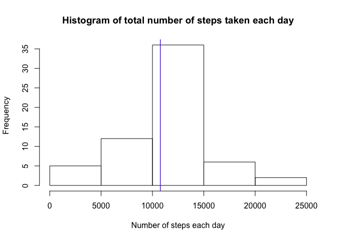
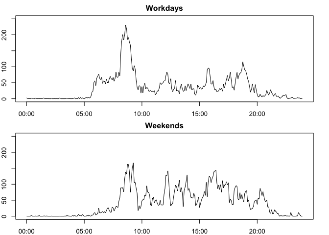

# Reproducible Research: Peer Assessment 1

This report is a solution of Peer Assignment 1 of [Reproducible Research](https://class.coursera.org/repdata-033) course on [Coursera](https://www.coursera.org/). The followig two paragraphs are taken directly from the assignment page.

##Introduction

It is now possible to collect a large amount of data about personal movement using activity monitoring devices such as a [Fitbit](http://www.fitbit.com/), [Nike Fuelband](http://www.nike.com/us/en_us/c/nikeplus-fuelband), or [Jawbone Up](https://jawbone.com/up). These type of devices are part of the “quantified self” movement – a group of enthusiasts who take measurements about themselves regularly to improve their health, to find patterns in their behavior, or because they are tech geeks. But these data remain under-utilized both because the raw data are hard to obtain and there is a lack of statistical methods and software for processing and interpreting the data.

This assignment makes use of data from a personal activity monitoring device. This device collects data at 5 minute intervals through out the day. The data consists of two months of data from an anonymous individual collected during the months of October and November, 2012 and include the number of steps taken in 5 minute intervals each day.

##Data

The data for this assignment can be downloaded from the course web site:

Dataset: [Activity monitoring data](https://d396qusza40orc.cloudfront.net/repdata%2Fdata%2Factivity.zip) [52K]
The variables included in this dataset are:

- __steps__: Number of steps taking in a 5-minute interval (missing values are coded as NA)
- __date__: The date on which the measurement was taken in YYYY-MM-DD format
- __interval__: Identifier for the 5-minute interval in which measurement was taken

The dataset is stored in a comma-separated-value (CSV) file and there are a total of 17,568 observations in this dataset.

## Loading and preprocessing the data

We expect the file _activity.zip_ to be located in the current working directory.


```r
setClass('activity_date')
setAs("character", "activity_date", function(from) as.Date(from, "%Y-%m-%d"))
data <- read.table(unz('activity.zip', 'activity.csv'), header=TRUE, sep=",", 
                   colClasses=c('numeric', 'activity_date', 'numeric'))
```

Here is a function to convenietly convert an interval number to its time representation.


```r
intervalToTime <- function(x) {
    t <- formatC(x, width=4, format='d', flag='0')
    t <- sub('([[:digit:]]{2,2})$', ':\\1', t)
    t <- as.POSIXct(t, format='%H:%M')
    return(t)
}
```

Calculate the total number of steps taken per day.


```r
total_steps_by_date <- aggregate(data$steps, by=list(data$date), FUN=sum)
colnames(total_steps_by_date) <- c('date', 'total')
```

Make a histogram of the total number of steps taken each day.


```r
hist(total_steps_by_date$total, main='Histogram of total number of steps taken each day', xlab=NULL)
total_steps_mean <- mean(total_steps_by_date$total, na.rm = TRUE)
total_steps_median <- median(total_steps_by_date$total, na.rm = TRUE)
abline(v=total_steps_mean, col='red')
abline(v=total_steps_median, col='blue')
```

 

Calculate the mean and median of the total number of steps taken per day.


```r
total_steps_mean
```

```
## [1] 10766.19
```

```r
total_steps_median
```

```
## [1] 10765
```

The mean is __10766.19__ and median is __10765__.

## What is the average daily activity pattern?

Create time series plot of the 5-minute interval (x-axis) and the average number of steps taken, averaged across all days (y-axis).


```r
mean_steps_by_interval <- aggregate(data$steps, by=list(data$interval), FUN=mean, na.rm=TRUE)
colnames(mean_steps_by_interval) <- c('interval', 'mean')
mean_steps_by_interval$time <- intervalToTime(mean_steps_by_interval$interval)
plot(mean_steps_by_interval$time, mean_steps_by_interval$mean, type='l', xlab='time', ylab='mean')
```

 

Find 5-minute interval containing the maximum number of steps on average across all the days.


```r
max_steps_interval <- mean_steps_by_interval[which.max(mean_steps_by_interval$mean), 'interval']
print(max_steps_interval)
```

```
## [1] 835
```

```r
intervalToTime(max_steps_interval)
```

```
## [1] "2015-10-10 08:35:00 CEST"
```

The maximum steps happened at __08:35am__.

## Imputing missing values

Calculate the total number of missing values in the dataset (i.e. the total number of rows with NAs).


```r
sum(is.na(data$steps))
```

```
## [1] 2304
```

There are __2304__ missing values in the dataset.

Fill in missing values. Replace missing value with particular mean computed for the given interval across all the days.


```r
data2 <- merge(x=data, y=mean_steps_by_interval, by='interval')
data2 <- data2[order(data2$date, data2$interval),]
data2[is.na(data2$steps),]$steps = data2[is.na(data2$steps),]$mean
```

Calculate the total number of steps taken per day.


```r
total_steps_by_date2 <- aggregate(data2$steps, by=list(data2$date), FUN=sum)
colnames(total_steps_by_date2) <- c('date', 'total')
hist(total_steps_by_date2$total, main='Histogram of total number of steps taken each day', xlab='Number of steps each day')
total_steps_mean2 <- mean(total_steps_by_date2$total)
total_steps_median2 <- median(total_steps_by_date2$total)
abline(v=total_steps_mean2, col='red')
abline(v=total_steps_median2, col='blue')
```

 

Calculate the mean and median of the total number of steps taken per day.


```r
total_steps_mean2
```

```
## [1] 10766.19
```

```r
total_steps_median2
```

```
## [1] 10766.19
```

The mean is __10766.19__ and median is __10766.19__. The mean differs from its previous value. It is now equal to the mean as the result of substitutioning all missing values with the mean. Also the peak of the histogram shifted up, but otherwise the histogram preserved its shape.

## Are there differences in activity patterns between weekdays and weekends?

Create a new factor variable in the dataset with two levels – “weekday” and “weekend” indicating whether a given date is a weekday or weekend day.


```r
data2$wd <- as.factor(weekdays(data2$date))
data2$day_type <- as.factor(ifelse(data2$wd %in% c("Saturday", "Sunday"), "weekend", "workday"))
```

Make a panel plot containing a time series plot of the 5-minute interval (x-axis) and the average number of steps taken, averaged across all weekday days or weekend days (y-axis).


```r
data_workday <- subset(data2, day_type == 'workday')
mean_steps_by_interval_workday <- aggregate(data_workday$steps, by=list(data_workday$interval), FUN=mean)
colnames(mean_steps_by_interval_workday) <- c('interval', 'mean')
mean_steps_by_interval_workday$time <- intervalToTime(mean_steps_by_interval_workday$interval)

data_weekend<- subset(data2, day_type == 'weekend')
mean_steps_by_interval_weekend <- aggregate(data_weekend$steps, by=list(data_weekend$interval), FUN=mean)
colnames(mean_steps_by_interval_weekend) <- c('interval', 'mean')
mean_steps_by_interval_weekend$time <- intervalToTime(mean_steps_by_interval_weekend$interval)

par(mfrow=c(2,1), pin=c(7,2), mar=c(2,2,2,2))
layout(matrix(c(1,1,2,2), 2, 2, byrow = TRUE))
plot(mean_steps_by_interval_workday$time, mean_steps_by_interval_workday$mean, type='l', ylim=c(0,250), xlab='time', ylab='mean', main='Workdays')
plot(mean_steps_by_interval_weekend$time, mean_steps_by_interval_weekend$mean, type='l', ylim=c(0,250), xlab='time', ylab='mean', main='Weekends')
```

 
